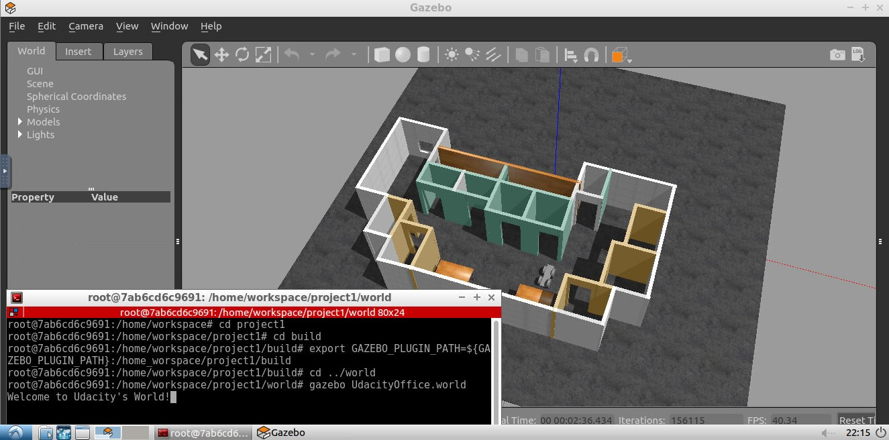

# Gazebo-World
A gazebo world made via Udacity's workspace
<br><br>
### Directory Structure
```
    .Gazebo-World
    ├── images                         # image preview                  
    │   ├── output.png
    ├── model                          # Model files of the robot
    │   ├── building
    │   │   ├── model.config
    │   │   ├── model.sdf
    │   ├── myrobot
    │   │   ├── model.config
    │   │   ├── model.sdf
    ├── script                         # welcome script      
    │   ├── welcome.cpp
    ├── world                          # Gazebo main World
    │   ├── UdacityOffice.world
    └── CMakeLists.txt                 # Link libraries 
                                  
```

### Steps to launch the simulation

#### Step 1 Update and upgrade the Workspace image
```sh
$ sudo apt-get update
$ sudo apt-get upgrade -y
```

#### Step 2 Clone the lab folder in /home/workspace/
```sh
$ cd /home/workspace/
$ git clone https://github.com/YoussefAli99/Gazebo-World
```

#### Step 3 Compile the code
```sh
$ cd /home/workspace/Gazebo-World/
$ mkdir build
$ cd build/
$ cmake ../
$ make
```

#### Step 4 Add the library path to the Gazebo plugin path  
```sh
$ export GAZEBO_PLUGIN_PATH=${GAZEBO_PLUGIN_PATH}:/home/workspace/Gazebo-World/build
```

#### Step 5 Run the Gazebo World file  
```sh
$ cd /home/workspace/Gazebo-World/world/
$ gazebo UdacityOffice.world
```

### Output
The welcome message and the robot inside the Gazebo World should both launch as follow: 
